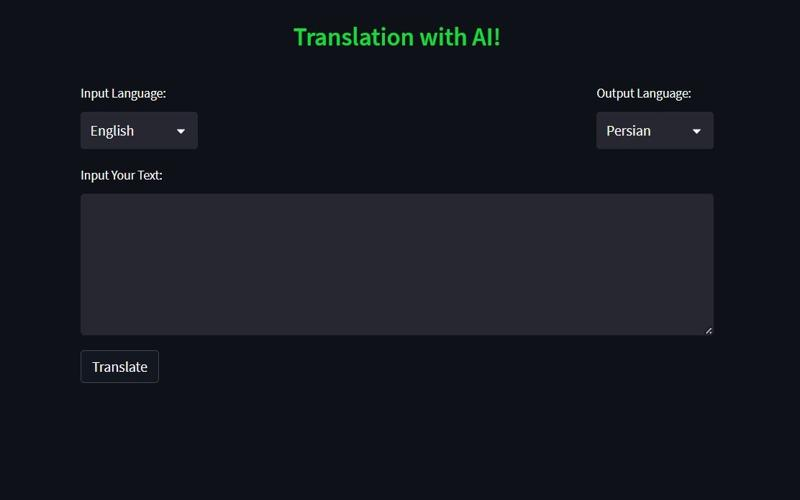

# PretrainedTranslate

This repository contains a translation system that utilizes the Pretrained M2M100 model by Facebook.

## Model and Tokenizer

The translation system uses the `M2M100ForConditionalGeneration` model and `M2M100Tokenizer` tokenizer from the `facebook/m2m100_418M` package. For more information about the model and tokenizer, please refer to the respective documentation.

## Installation

To use this repository, you need to install the model and tokenizer. You can use the following commands:

```bash
pip install torch
pip install transformers
pip install sentencepiece
```

## Usage
Once you have installed the model and tokenizer, you can use the translation system. Below is an example code snippet for utilizing this system:
``` python
from transformers import M2M100ForConditionalGeneration, M2M100Tokenizer

model = M2M100ForConditionalGeneration.from_pretrained("facebook/m2m100_418M")
tokenizer = M2M100Tokenizer.from_pretrained("facebook/m2m100_418M")

def translate(text, source_lang, target_lang):
    input_ids = tokenizer.encode(text, return_tensors="pt", padding=True, truncation=True, max_length=512)
    translated_ids = model.generate(input_ids=input_ids, decoder_start_token_id=model.config.pad_token_id, 
                                    forced_bos_token_id=tokenizer.lang_code_to_id[source_lang],
                                    forced_eos_token_id=tokenizer.lang_code_to_id[target_lang])
    translated_text = tokenizer.batch_decode(translated_ids, skip_special_tokens=True)
    return translated_text

# Example Usage
source_text = "This is a test example."
source_lang = "en"
target_lang = "fr"

translation = translate(source_text, source_lang, target_lang)
print(translation)
```

You can access the [Colab notebook file](https://colab.research.google.com/drive/1n2kg3eLyhsfIxtFNhOES8CXHIPXKbbDV) using this link.

---

## Streamlit Translation App



This repository contains a simple translation app written in Python using Streamlit. The app allows users to enter a text and select a language for translation. The translated text is then displayed to the user.

## Usage
1. Run the app.py file:

```bash
streamlit run app.py
```

2. Open your web browser and go to http://localhost:8501.

3. In the app, enter the text you want to translate in the provided input box.

4. Select the desired language from the language dropdown menu.

5. Click the "Translate" button.

6. The translated text will be displayed below the button.

7. You can repeat the process to translate more texts or change the target language as needed.

## Contribution
If you are interested in contributing to the PretrainedTranslate repository, you can submit a Pull Request or report any relevant issues in the repository's issue tracker.

``` vbnet
I hope this meets your requirements. Let me know if there's anything else I can help you with!
```