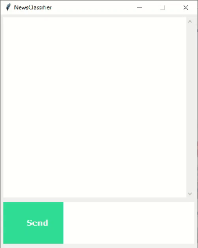

# NewsClassifier Project

This repository contains a project for news classification in the Persian language. The goal of the project is to classify news articles into various categories based on predefined labels.

### Installation

1. Clone this repository to your local machine using the following command:

   ```shell
   git clone https://github.com/MohamadsalehMoradpoor/TextAIHub.git
   ```

2. Navigate to the project directory:

    ```shell
    cd NewsClassifier
    ```

3. Install the required dependencies:

    ```shell
    pip install -r requirements.txt
    ```

## Usage

To classify news articles, you can use the trained model as follows:

1. Load the trained model.
2. Preprocess the news article text.
3. Pass the preprocessed text through the model.
4. Retrieve the predicted category label.

---

## NewsClassifier Desktop Application



The application is built using the tkinter library in Python, providing a user-friendly interface for classifying news articles into various categories based on predefined labels.

### Installation and Setup

To use this desktop application, you need to follow these steps:

1. Download the executable file (`NewsClassifier.exe`) from the [Releases](https://github.com/MohamadsalehMoradpoor/TextAIHub/tree/master/NewsClassifier/) page.
2. Run the executable file to launch the application.

### Usage

Once you have launched the desktop application, you can follow these steps to classify news articles:

1. Enter the news article text in the provided input field.
2. Click the "Send" button.
3. The application will display the predicted category label for the news article.

---

## NewsClassifier Streamlit Application


This repository contains a Streamlit application for news classification in the Persian language. The application provides an interactive interface for classifying news articles into various categories based on predefined labels.

### Installation and Setup

To install and run the Streamlit application, please follow these steps:

1. Clone the repository to your local machine.
2. Install the required dependencies listed in the `requirements.txt` file.
3. Run the following command to start the application:

   ```bash
   streamlit run app.py
   ```

### Contribution

Contributions to this project are welcome. If you have any ideas or suggestions, feel free to open an issue or submit a pull request.
